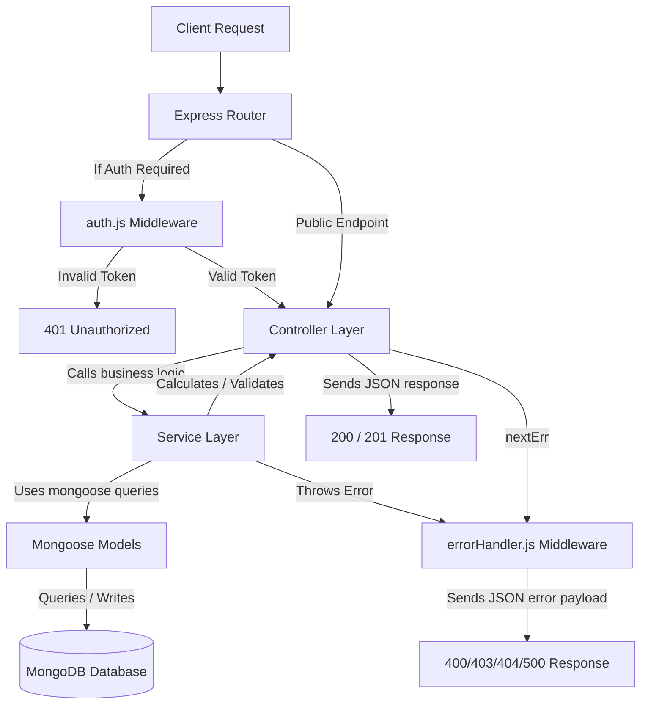
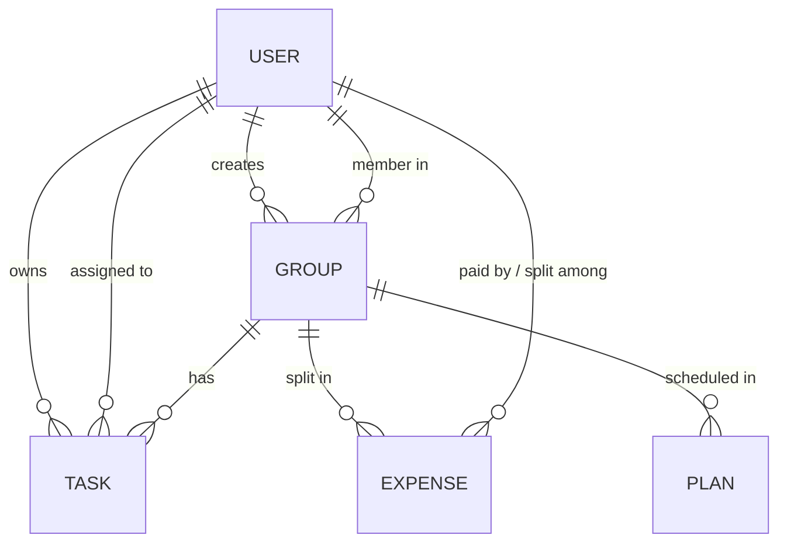

# Smart Group To-Do & Planner API Flow Documentation

This document outlines the architecture, data models, request lifecycle, and business logic flows for the **Smart Group To-Do & Planner API** backend project.

---

## 📂 Project Structure

The project follows a standard **layered architecture** pattern (Routes ➔ Controllers ➔ Services ➔ Models), separating HTTP concerns, orchestration, business logic, and database mapping:

```text
note-api/
├── config/             # Configuration settings
│   ├── db.js           # Mongoose database connection setup
│   └── env.js          # Centralized environment variables
├── controllers/        # Express route handlers (orchestrators)
│   ├── auth.js         # Register / Login handlers
│   ├── groups.js       # Group management handlers
│   ├── tasks.js        # Personal and Group task handlers
│   ├── expenses.js     # Group expense logging & Splitwise-like balance handlers
│   └── plans.js        # Itinerary plan handlers
├── middleware/         # Custom Express middlewares
│   ├── auth.js         # JWT Authentication verification
│   └── errorHandler.js # Centralized Mongoose and custom error handler
├── models/             # Mongoose Schemas (MongoDB collections)
│   ├── user.js         # User Account Schema
│   ├── group.js        # Group Schema
│   ├── task.js         # Task & Checklist Subtask Schema
│   ├── expense.js      # Expense Split Schema
│   └── plan.js         # Itinerary/Schedule Plan Schema
├── routes/             # Express routes with JSDoc Swagger markup
│   ├── authRoutes.js   # Auth routes (/api/auth)
│   ├── groupRoutes.js  # Group routes (/api/groups)
│   ├── taskRoutes.js   # Task routes (/api/tasks)
│   ├── expenseRoutes.js# Expense routes (/api/groups/:groupId/expenses)
│   └── planRoutes.js   # Plan routes (/api/groups/:groupId/plans)
├── services/           # Reusable core business logic layer
│   ├── authService.js  # Registration, hashing, token generation
│   ├── groupService.js # Group actions, member validation
│   ├── taskService.js  # Task filtering, stats tracking
│   ├── expenseService.js # Greedy Splitwise transaction solver
│   └── planService.js  # Itinerary logic
├── index.js            # Express application entrypoint
├── package.json        # Dependencies & start scripts
└── package-lock.json   # Lockfile
```

---

## 🔄 Request-Response Lifecycle Flow

All API requests pass through the following execution pipeline:



1. **Routing Layer (`/routes`)**: Maps endpoints to Controller functions and manages API documentation metadata (Swagger JSDocs).
2. **Middleware (`/middleware`)**: 
   - `auth.js` intercepts private routes, validates the JWT, and extracts the `userId` into `req.user`.
   - `errorHandler.js` intercepts failures, maps database validation errors, format errors (`CastError`), and duplicate entry errors to user-friendly messages.
3. **Controller Layer (`/controllers`)**: Standardizes input variables (e.g. `req.body`, `req.params`, `req.query`, and authenticated `req.user.userId`) and delegates processing to services.
4. **Service Layer (`/services`)**: Contains target logic. Validates permissions, calculates data (like expenses and stats), interacts with Mongoose schemas, and throws formatted error objects with custom status codes.
5. **Model Layer (`/models`)**: Defines structure, schema constraints, and triggers database triggers (e.g. `pre-save` updating the `updatedAt` field on Tasks).

---

## 🗃️ Database Models & Relationships

The API manages five collections with Mongoose schemas:



### 1. User (`models/user.js`)
* **Fields**: `username` (Unique, string), `password` (Hashed string), `createdAt`.
* **Flow role**: Authentication subject. All items in the application are linked to users.

### 2. Group (`models/group.js`)
* **Fields**: `name` (String), `description` (String), `members` (Array of User References), `createdBy` (User Reference), `createdAt`.
* **Flow role**: Acts as a namespace for collaborating on tasks, tracking debts, and sharing trip plans.

### 3. Task (`models/task.js`)
* **Fields**: 
  - `user` (User Reference, owner)
  - `group` (Group Reference, optional)
  - `assignees` (Array of User References, optional)
  - `title` (String), `description` (String)
  - `status` (Enum: `pending`, `in_progress`, `completed`)
  - `priority` (Enum: `low`, `medium`, `high`)
  - `dueDate` (Date), `tags` (Array of Strings)
  - `subtasks` (Checklist array: `title`, `isCompleted`)
  - `recurrence` (Enum: `none`, `daily`, `weekly`, `monthly`)
  - `dueReminderTime` (Date), `reminderSent` (Boolean)
  - `createdAt`, `updatedAt` (Managed by `pre-save` hook)
* **Flow role**: Tracks checklists and work details. Can be personal (group = null) or group-owned.

### 4. Expense (`models/expense.js`)
* **Fields**: `group` (Group Reference), `description` (String), `amount` (Number), `paidBy` (User Reference), `splitAmong` (Array of User References), `date` (Date).
* **Flow role**: Tracks shares of transactions inside a group.

### 5. Plan (`models/plan.js`)
* **Fields**: `group` (Group Reference), `title` (String), `description` (String), `location` (String), `startTime` (Date), `endTime` (Date), `category` (Enum: `travel`, `lodging`, `activity`, `food`, `function_event`, `other`), `createdAt`.
* **Flow role**: Represents trip schedules, bookings, and event itineraries for group projects.

---

## 🛠️ Detailed Module Flow Analysis

### 1. Authentication Flow
* **Register (`POST /api/auth/register`)**:
  1. Checks if `username` and `password` are provided.
  2. Searches MongoDB for an existing user with the same `username`.
  3. If taken, throws a `400` status error.
  4. Generates a salt (cost factor = 10) using `bcryptjs` and hashes the password.
  5. Saves a new User record and responds with success.
* **Login (`POST /api/auth/login`)**:
  1. Checks if credentials are provided.
  2. Queries User model for `username`. Throws `400` if not found.
  3. Compares incoming password with hashed password using `bcrypt.compare()`. Throws `400` if mismatch.
  4. Signs a JWT token containing `{ userId: user._id }` using `JWT_SECRET`, set to expire in **1 hour**.
  5. Returns token to the client.

---

### 2. Group Collaboration Flow
* **Create Group (`POST /api/groups`)**: Creates a Group where the creator is automatically added as the first member.
* **List Groups (`GET /api/groups`)**: Retrieves groups where the logged-in `userId` exists in the `members` array. Populates the creator's username.
* **Invite Member (`POST /api/groups/:groupId/invite`)**:
  1. Checks if the designated group exists.
  2. Verifies that the inviter is already a member of the group (Access verification).
  3. Looks up the invitee by username in the database.
  4. Confirms that the invitee is not already in the group members list.
  5. Pushes the invitee's `_id` into the `members` array and saves.
* **Get Members (`GET /api/groups/:groupId/members`)**: Lists all users belonging to the group (Only accessible by current members).

---

### 3. Task Management Flow
* **Creating (`POST /api/tasks`)**:
  - If a `groupId` is supplied, the service verifies that the user belongs to the group, and checks if any assigned users (`assignees`) are also members.
  - If no `groupId` is supplied, it is classified as a personal task.
* **Retrieving (`GET /api/tasks`)**:
  - If `groupId` query parameter is provided: Verifies membership and returns tasks belonging to that group.
  - If `groupId` is omitted: Returns personal tasks (where `group` is null and `user` is the current user).
  - Supports search filters (`status`, `priority`, `tag`, and a regex text-search in `title` and `description`) and sorting.
* **Stats Tracker (`GET /api/tasks/stats`)**:
  - Dynamically calculates task metrics (Total, Completed, In Progress, Pending, Overdue, and Completion Rate %) for personal tasks or a group.
* **Updating/Deleting (`PUT/:id`, `DELETE/:id`)**:
  - Enforces authorization: A user can only edit or delete a task if they belong to its associated group, or if it is a personal task they created.

---

### 4. Expense Split & Settlement Flow
* **Add Expense (`POST /api/groups/:groupId/expenses`)**:
  - Verifies group membership.
  - Sets the payer (defaulting to the current user) and validation list (`splitAmong`).
  - If no split is specified, defaults to splitting the amount evenly among **all** group members.
* **Get Balances & Debt Settlement Solver (`GET /api/groups/:groupId/expenses/balances`)**:
  1. **Net Balance Calculation**: Initializes net balance for all group members to `0`. Iterates through all group expenses:
     - Adds `amount` to the payer's net balance.
     - Subtracts `amount / splitCount` from the net balance of each member in `splitAmong`.
  2. **Classify Debtors and Creditors**: Splits members into two arrays:
     - **Debtors** (net balance < 0, meaning they owe money).
     - **Creditors** (net balance > 0, meaning they are owed money).
  3. **Greedy Transaction Resolution**:
     - Sorts Debtors from largest debt to smallest.
     - Sorts Creditors from largest credit to smallest.
     - Greedily resolves debts by matching the largest debtor with the largest creditor, paying the minimum of `abs(debt)` or `credit`.
     - Records the settlement step `{"from": "Debtor", "to": "Creditor", "amount": X}`.
     - Adjusts the balances and advances index once an account settles to `0`.
  4. Returns the lists of overall balances and the minimum set of transactions required to clear all debts.

---

### 5. Itinerary Planner Flow
* **Add Plan (`POST /api/groups/:groupId/plans`)**: Creates schedule entries (e.g. check-ins, travel bookings, flights) associated with a group. Categories allowed: `travel`, `lodging`, `activity`, `food`, `function_event`, `other`.
* **List Plans (`GET /api/groups/:groupId/plans`)**: Returns plans sorted chronologically by `startTime` (Allows filter by `category`).
* **Update / Delete (`PUT/:planId`, `DELETE/:planId`)**: Validates membership in the group before updating or removing plans.

---

## 🔒 Error Handling Strategy

The centralized error middleware (`middleware/errorHandler.js`) handles application failures automatically:

1. **Validation Errors**: Captures Mongoose schema validation failures and formats them as a clean list of broken rules.
2. **Duplicate Key Errors**: Detects MongoDB conflict code `11000` (e.g. duplicate username during registration) and maps it to a descriptive `400` message.
3. **Format Errors (CastError)**: Catches invalid MongoDB ObjectId inputs and formats them as bad requests.
4. **General Errors**: Responds with a custom status code if set by the service layer, defaulting to `500` with the error trace disabled in production.
